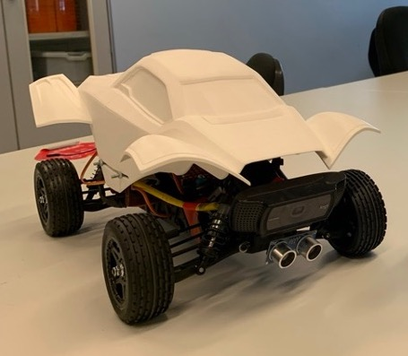

# race-car

This is a python program meant to be ran on a SoC board (like a raspberry pi) to control a car. The car uses a video input device (like a webcam) with OpenCV to find lines, which it will follow.



## To install:
```
./install.sh
```

or

```
python3 -m pip -r requirements.txt
```

## To run

```
python3 main.py
```